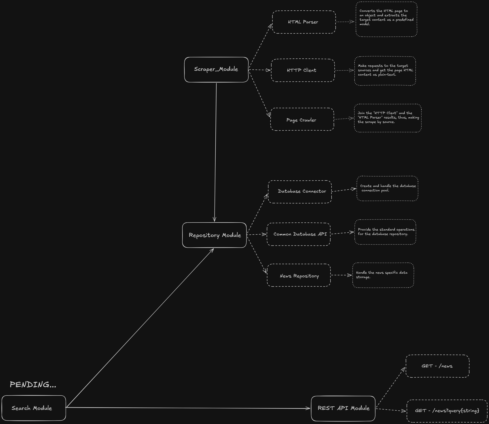

# Scholar News

> This project aims to be a news aggregator that collects news from different college portals. It provides a (TF/IDF) search engine that not only retrieves related news, but also ranks them.

## Adjustments and Enhancements

The project is still in development and the next updates will focus on the following tasks:

- [ ] Build the HTTP Client Service

- [ ] Build the Base Scraper Service

- [ ] Build the Base News Parser Service

## Requirements

- Python 3.13.5 or higher
- Execute <code>python3 -m venv venv</code>
- Execute <code>source venv/bin/activate</code>
- Install the requirements with <code>python -m pip install -r requirements.txt</code>

After these steps, you are ready to use the project's features.